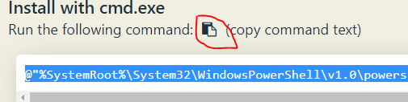

# 課前準備工作

## 安裝工具
- chocolatey
- helm

## 安裝chocolatey && helm 
1. 前往https://chocolatey.org/install

2. 點擊紅色框處，即可複製chocolatey安裝指令

3. 以系統管理者身份開啟CMD, 貼上chocolatey安裝指令並執行

4. 輸入 choco --version，確認chocolatey是否有安裝成功

5. 輸入choco install kubernetes-helm以安裝helm套件
6. 輸入helm -h ，確認helm是否有安裝成功