# 課前準備工作

## 安裝工具
- Docker
- Azure cli (https://docs.microsoft.com/zh-tw/cli/azure/install-azure-cli-windows?view=azure-cli-latest)
- Visual Studio Code (https://code.visualstudio.com/)
- Visual Studio Code 套件
    - https://marketplace.visualstudio.com/items?itemName=PeterJausovec.vscode-docker
    - https://marketplace.visualstudio.com/items?itemName=ms-kubernetes-tools.vscode-kubernetes-tools
    - https://marketplace.visualstudio.com/items?itemName=ms-vscode.azure-account
    - https://marketplace.visualstudio.com/items?itemName=ms-vscode.azurecli

## Docker安裝流程 (for win10)
1. win10啟用Hyper-v

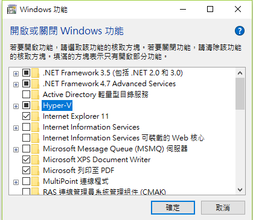

2. 申請Docker hub帳號 (https://hub.docker.com/)

3. 進入Docker windows版本下載連結 (https://store.docker.com/editions/community/docker-ce-desktop-windows)

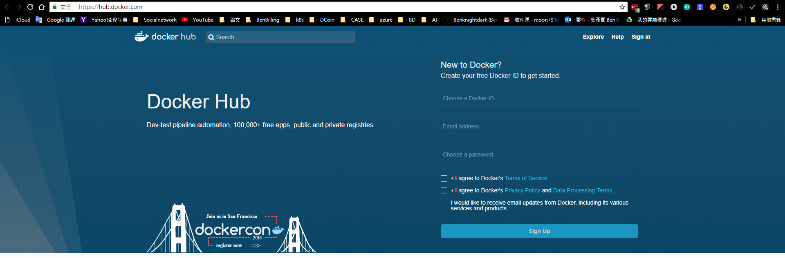

4. 點擊"Please login To Download"連結，並用DOCKER帳號登入

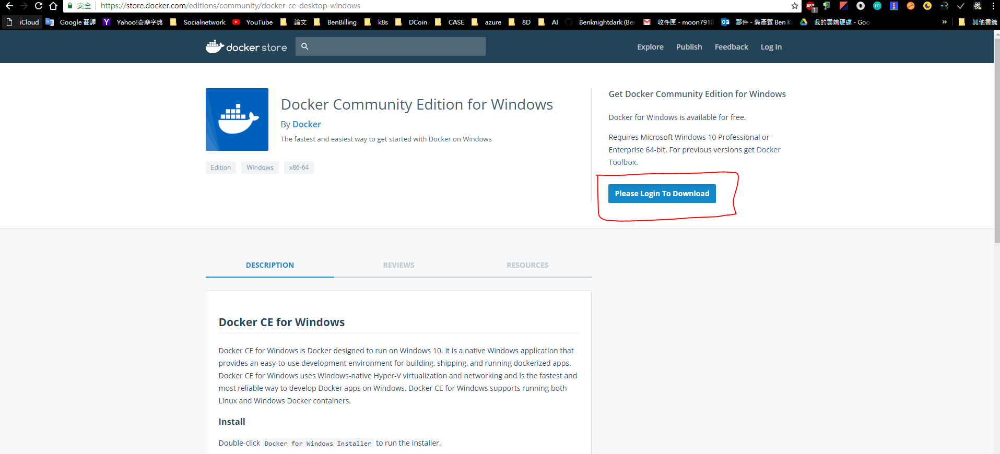

5.  登入完成後，會返回到下載Windows版本Docker的網頁，並滑至下方，會有兩種版本的Docker下載連結，請下載Edge Channel的版本

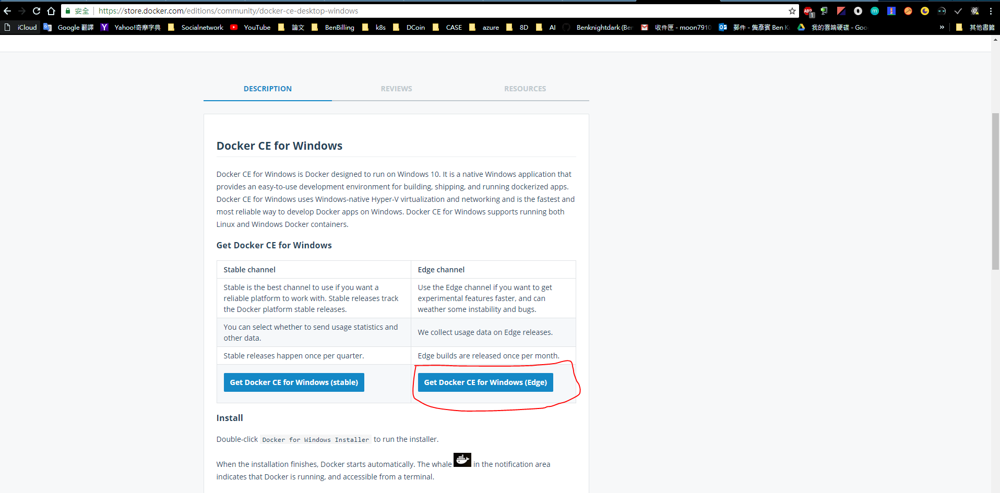

6. 下載完成後，點擊Docker的安裝檔

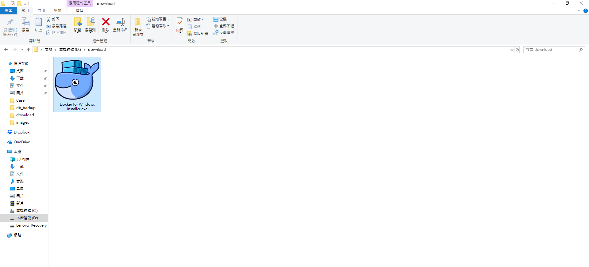

7. 完成安裝後，會在桌面看到Docker執行檔，請以【系統管理者身份】點擊

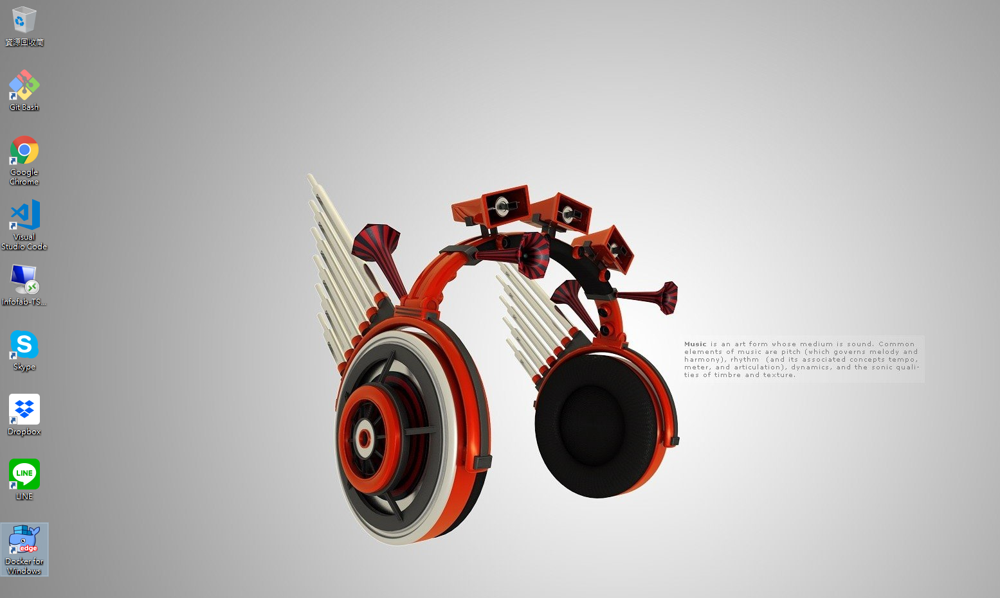

8. 點擊後，在桌面右下角功能列會出現一直鯨魚在噴水，當牠噴完水並且外觀為白色，代表Docker已經執行成功

9. 右鍵點擊鯨魚，並點擊Sign in選項後，輸入自己的Docker hub帳密

10. (此步驟可作可不作) 右鍵點擊鯨魚，並點擊Settings選項後

11. (此步驟可作可不作) 點擊Advanced選項，可依自己的需求修改docker vm的位置

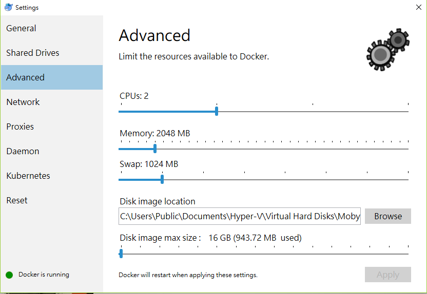

12. 開啟Command line 程式，輸入 docker -v 查詢目前本機的docker版本

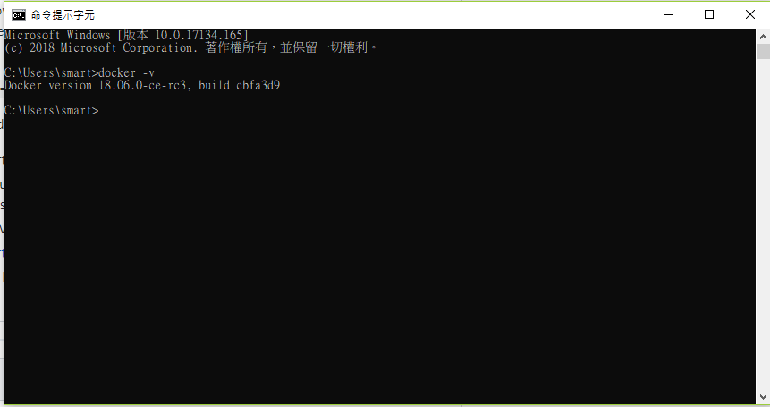

13. 輸入docker login，並輸入自己的Docker hub帳密

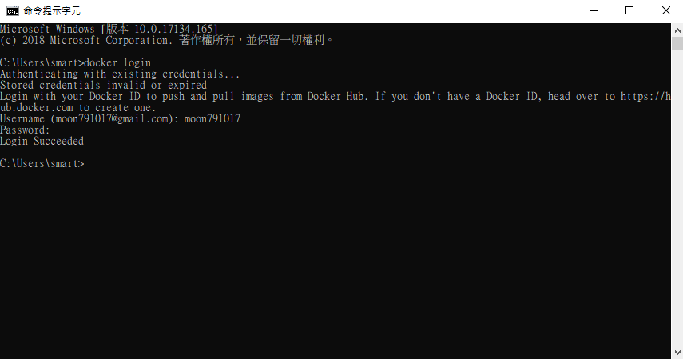

14. 輸入docker run hell-world，建立一個測試用Container

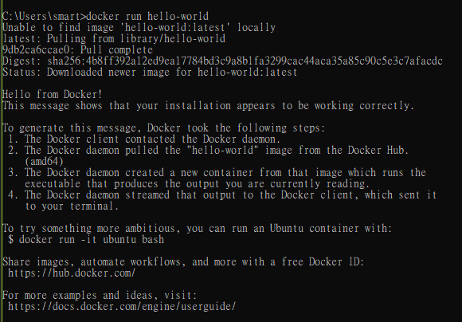

15. 輸入docker ps -a，查詢在step 13所建立的Conatainer是否有執行成功

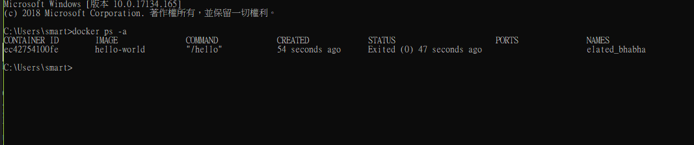

## issue solution
- https://github.com/docker/for-win/issues/1631#issuecomment-371256016